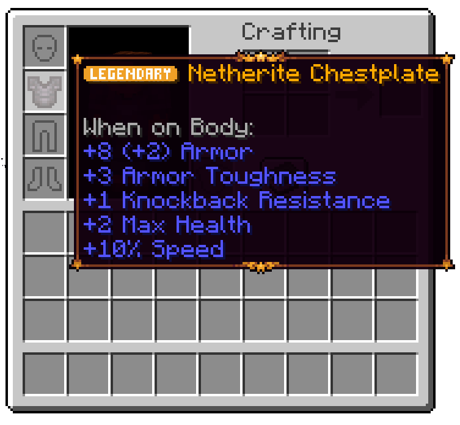

# Tierify

**Tierify** is a flavor of **Tiered** made with the purpose of fitting my own personal vision, and to fix some issues it had. It is a fork of **TieredZ** by **Globox_Z**, which is an MIT licensed **Tiered** fork.

The original mod, Tiered, is inspired by [Quality Tools](https://www.curseforge.com/minecraft/mc-mods/quality-tools). Every tool you make will have a special modifier, as seen below:



### Differences
Tierify expands upon Tiered by changing various things, but keeps its mod id and API packages the same, to make it compatible with preexisting addons.

- **Mythic Quality**
  The "Unique" quality was replaced with a red-themed Mythic quality.
- **Plates**
  Qualities may now be displayed with plates, this is a clientside feature and is configurable, comes enabled by default.
- **Reforging Tiers**
  Reforging doesn't require Amethyst anymore, now instead it uses 3 new ores obtainable
  - **Tier 1:** Limestone (Overworld)
    Allows reforging tools to Common, Uncommon and Rare qualities.
  - **Tier 2:** Pyrite (Nether)
    Allows reforging tools to Uncommon, Rare, Epic and Legendary qualities.
  - **Tier 3:** Galena (End)
    Allows reforging tools to Rare, Epic, Legendary and Mythic qualities.

### Installation
Tierify is a mod built for the [Fabric Loader](https://fabricmc.net/). It requires [Fabric API](https://www.curseforge.com/minecraft/mc-mods/fabric-api) & [Necronomicon API](https://www.curseforge.com/minecraft/mc-mods/necronomicon) (and [Synitra Connector](https://www.curseforge.com/minecraft/mc-mods/sinytra-connector) if on Forge/NeoForge) to be installed separately; all other dependencies are included inside the mod.

### Customization

Tierify is entirely data-driven, which means you can add, modify, and remove modifiers as you see fit. The base path for modifiers is `data/modid/item_attributes`, and tiered modifiers are stored under the modid of tiered. Here's an example modifier called "Hasteful," which grants additional dig speed when any of the valid tools are held:
```json
{
  "id": "tiered:hasteful",
  "verifiers": [
    {
      "tag": "c:pickaxes"
    },
    {
      "tag": "c:shovels"
    },
    {
      "tag": "c:axes"
    }
  ],
  "weight": 10,
  "style": {
    "color": "GREEN"
  },
  "attributes": [
    {
      "type": "generic.dig_speed",
      "modifier": {
        "name": "tiered:hasteful",
        "operation": "MULTIPLY_TOTAL",
        "amount": 0.10
      },
      "optional_equipment_slots": [
        "MAINHAND"
      ]
    }
  ]
}
```

#### Attributes

Tiered currently provides 3 custom attributes: Dig Speed, Crit chance and Durability. Dig Speed increases the speed of your block breaking (think: haste), Crit Chance offers an additional random chance to crit when using a tool and Durability increases, who would have thought it, the durability of an item.

Types: `generic.armor`, `generic.armor_toughness`, `generic.dig_speed`, `tiered:generic.durable`, `generic.max_health`, `generic.movement_speed`, `reach-entity-attributes:reach`, `generic.luck`, `generic.attack_damage`, `tiered:generic.crit_chance`, `reach-entity-attributes:attack_range`, `tiered:generic.range_attack_damage`

#### Verifiers

A verifier (specified in the "verifiers" array of your modifier json file) defines whether or not a given tag or tool is valid for the modifier. 

A specific item ID can be specified with:
```json
"id": "minecraft:apple"
```

and a tag can be specified with:
```json
"tag": "c:helmets"
```

Tiered doesn't provide tags but [AutoTag](https://github.com/apace100/autotag) (which is included in this mod) generates several tags which can be found on the repo [README](https://github.com/apace100/autotag#readme).
Example tags which AutoTag provides: `c:tools`, `c:pickaxes`, `c:axes`, `c:shovels`,`c:hoes`, `c:swords`, `c:armor`, `c:helmets`, `c:chestplates`, `c:leggings`, `c:boots` and several more.

#### Weight

The weight determines the commonness of the tier. Higher weights increase the chance of being applied on the item and vice versa.

#### Nbt

Custom nbt can get added via nbtValues, an example can be found below. It supports only string, boolean, integer and double values.\ 
Caution! Once added nbt keys won't get removed when once applied, just the values can get updated!

```json
"nbtValues": {
  "Damage": 100,
  "key": "value"
}
```

#### Tooltip
Since V1.2, custom tooltip borders can get set via a resource pack.
- The border texture has to be in the `assets\tiered\textures\gui` folder.
- The file has to be a json file and put inside the `assets\tiered\tooltips` folder.
- The `background_gradient` can also get set.
- The gradients has to be hex code, check transparency here: [https://gist.github.com/lopspower/03fb1cc0ac9f32ef38f4](https://gist.github.com/lopspower/03fb1cc0ac9f32ef38f4)
- Check out the default datapack under `src\main\resources\assets\tiered\tooltips`.

Example:
```json
{ 
    "tooltips": [
        {
            "index": 0,
            "start_border_gradient": "FFBABABA",
            "end_border_gradient": "FF565656",
            "texture": "tiered_borders",
            "decider": [
                "set_the_id_here",
                "tiered:common_armor"
            ]
        }
    ]
}
```

#### Reforge

Reforging items to get other tiers can be done at the anvil. There is a slot which is called "base" on the left and a slot called "addition" on the right.
The addition slot can only contain items which are stated in each tier item tag (`tiered:reforge_tier_1`, `tiered:reforge_tier_2`, `tiered:reforge_tier_3`). The base slot can contain the reforging item material item if existent, otherwise it can only contain `tiered:reforge_base_item` tag items. The base slot item can get changed via datapack, an example can be found below and has to get put in the `tiered:reforge_items` folder.

```json
{
  "items": [
    "minecraft:bow"
  ],
  "base": [
    "minecraft:string"
  ]
}
```

### Credits
- **Draylar1** for making **Tiered**, the original mod.
- **Globox_Z** for making **TieredZ**, a fork of Tiered which Tierify is based upon.

### License
Tierify's code is licensed under MIT. You are free to use the code inside this repo as you want as long as you meet the license's conditions.
Newer assets (Such as Limestone, Pyrite and Galena ores) are All Rights Reserved, and you may not use them without explicit permission.
